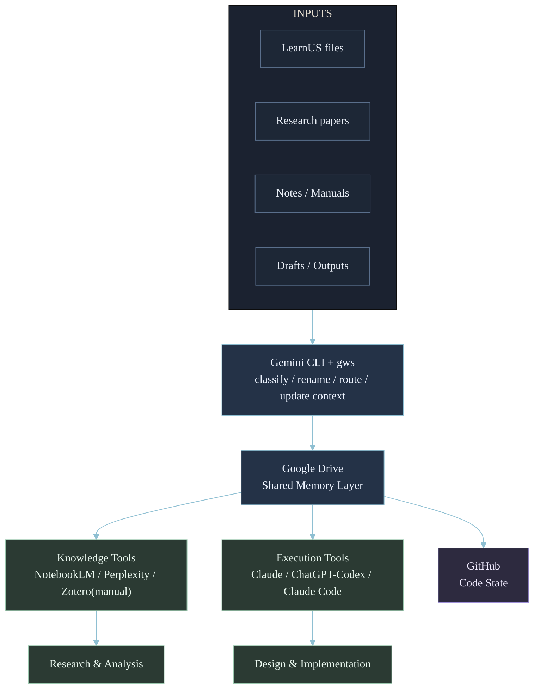

---
title: "Building My Personal AI Utilization System"
date: 2026-03-12
description: "A practical architecture for using AI tools in research, learning, and software development."
categories: [AI Workflow, Architecture, Productivity]
toc: true
---

A practical architecture for using AI tools in research, learning, and software development.

## Motivation
AI tools are powerful, but using them independently often leads to messy workflows.

A typical workflow might look like this:

`Ask ChatGPT -> open Perplexity -> upload to NotebookLM -> copy results to Drive -> repeat`

Over time, several problems appear:

- context becomes fragmented
- knowledge spreads across multiple tools
- switching between AIs creates friction
- long-term work lacks a persistent structure

The limitation is not the capability of AI models.
The real problem is the lack of a clear architecture for using them together.

## Goal
The goal of this project is simple:

Design a system where multiple AI tools cooperate instead of being used independently.

The system should support:

- studying university courses
- managing research materials
- writing long documents
- building software projects
- organizing knowledge over time

The focus is practical workflow, not theoretical design.

## Key Idea
Instead of relying on a single AI tool for everything, the system assigns specific roles to different tools.

| Function | Tool |
|---|---|
| Search | Perplexity |
| Store | Zotero |
| Analyze | NotebookLM |
| Organize | Gemini |
| Design | Claude |
| Build | ChatGPT / Codex |
| Code State | GitHub |
| Memory | Google Drive |
| Control | gws CLI |

Each tool is used for what it does best.
The result is a simple but structured AI working environment.

## Philosophy
The system follows three basic principles.

1. AI assists thinking, it does not replace it. Human judgment remains central.
2. AI is a cognitive tool. It extends research, coding, and learning workflows.
3. Working systems > perfect systems. A simple system used consistently is better than a perfect design never used.

## Architecture Overview
The system is centered around Google Drive as a shared knowledge and memory layer.
The main operational interface to this layer is Gemini CLI, which interacts with Google Drive through gws.

Pattern:

`Inputs -> Gemini CLI -> Google Drive -> AI tools -> Outputs`

`                                 \-> GitHub (code state)`

Raw materials enter the system, Gemini organizes them, AI tools consume the organized state, and outputs are written back into the system.

## Architecture Diagram


## Core Architectural Principle
The system separates two types of state.

### Knowledge State (Google Drive)
Includes:

- course materials
- research summaries
- documentation
- project notes
- shared AI context

### Code State (GitHub)
Includes:

- source code
- version history
- software projects

This separation keeps research workflows and development workflows clean.

## Google Drive Folder Architecture
Google Drive acts as the shared memory layer.
All AI tools interact with this layer either directly or indirectly.

### Root Structure
::: {.columns}
::: {.column width="50%"}
```text
AI_OS/
├── University/
├── Projects/
└── Librarian/
```
:::
::: {.column width="50%"}
- `University`: academic course materials
- `Projects`: personal and development projects
- `Librarian`: global AI system documentation
:::
:::

### Librarian (Global Context)
::: {.columns}
::: {.column width="50%"}
```text
Librarian/
├── architecture.md
├── routing.md
└── decisions.md
```
:::
::: {.column width="50%"}
- `architecture.md`: overall system architecture
- `routing.md`: AI tool selection rules
- `decisions.md`: important conventions and design choices
:::
:::

### Local `librarian_memory`
::: {.columns}
::: {.column width="50%"}
```text
University/
└── 2026_Spring/
    └── CAS2101_Discrete_Mathematics/
        └── librarian_memory/
```
:::
::: {.column width="50%"}
```text
Projects/
└── Personal_Website/
    └── librarian_memory/
```
:::
:::

Local folders store current task, progress state, notes, and handoff context.

- Global context -> `Librarian/`
- Local context -> `librarian_memory/`

## Gemini-Managed Memory
Both `Librarian/` and local `librarian_memory/` folders are strongly recommended to be managed automatically by Gemini.

Through Gemini CLI + gws, Gemini can:

- organize files
- maintain task context
- summarize documents
- update working memory
- preserve continuity across sessions

In this architecture, Gemini acts as the system librarian.

## Workspaces
### University Workspace
```text
University/
└── 2026_Spring/
    └── CAS2101_Discrete_Mathematics/
        ├── lectures/
        ├── assignments/
        ├── announcements/
        ├── outputs/
        └── librarian_memory/
```

### Project Workspace
```text
Projects/
├── Personal_Website/
│   └── librarian_memory/
└── AI_Research_OS/
    └── librarian_memory/
```

Each workspace is intentionally flexible, but should include `librarian_memory/`.

## Example Workflows
### Scenario 1 - Automatic Course Material Organization
Course files from LearnUS are passed to Gemini CLI.
Gemini:

- reads file
- detects course information
- renames document
- places it in the correct folder
- updates local context

Example:

`00. Course Introduction.pdf`

-> `CAS2101_L00_Course_Introduction.pdf`

Stored in:

`University/2026_Spring/CAS2101_Discrete_Mathematics/lectures/`

### Scenario 2 - Project Documentation Management
Code is managed in GitHub.
Non-code outputs are managed in Drive:

- documentation
- design notes
- architecture diagrams
- manuals

### Scenario 3 - Research Workflow
Pipeline:

`Perplexity -> Zotero -> NotebookLM -> Claude`

1. Discover papers with Perplexity
2. Store original PDFs in Zotero
3. Analyze in NotebookLM
4. Reason and synthesize with Claude

Important distinction:

Zotero is the authoritative paper archive and is managed manually by the user.

### Scenario 4 - Shared Context Across AI Tools
Store cross-session context files in `librarian_memory/`:

- `current_task.md`
- `handoff.md`
- `brief.md`

Multiple tools can read these files to restore context.

### Scenario 5 - Automatic Schedule Extraction
Gemini CLI can extract important dates and update Google Calendar.

Example:

- Midterm: April 21
- Final: June 16

Potential calendar events:

- CAS2101 Midterm
- CAS2101 Final Exam

## Environment Setup
### Step 1 - Identity Layer
Required services:

- Google
- GitHub
- OpenAI
- Anthropic
- Perplexity

Strong recommendation: use one Google account as primary identity.

### Step 2 - Development Environment
Install:

- Git
- VS Code
- Node.js or Python
- Terminal environment

### Step 3 - Gemini CLI and Google Drive Integration
Core components:

- Google Cloud project
- gcloud CLI
- gws CLI
- Gemini CLI
- Google Drive for desktop

Recommended order:

1. Install Google Drive for desktop
2. Install gcloud CLI
3. Create Google Cloud project
4. Install and authenticate gws CLI
5. Install Gemini CLI

Result:

`Gemini CLI -> gws -> Google Drive`

### Step 4 - AI Tools
Web tools:

- Perplexity
- NotebookLM

CLI tools:

- Gemini CLI
- Codex CLI
- Claude Code

App/Web tools:

- ChatGPT
- Claude

### Step 5 - Optional Infrastructure
- Zotero: paper archive
- Docker: reproducible environments
- GoodNotes: handwritten notes

Setup philosophy:

Use loosely connected components through shared resources (`Google Drive`, `GitHub`, local files), rather than tightly coupling all tools.

## Conclusion
AI tools are powerful, but independent use often leads to fragmented workflows and lost context.

This architecture treats AI tools as specialized components inside a structured system.
By assigning clear roles and using Google Drive as a shared memory layer, it enables:

- organized knowledge
- persistent AI context
- coordinated workflows across tools

The goal is simple:

Turn a collection of AI tools into a structured working system.

## Repository
Reference implementation:

[https://github.com/smkgenesis/ai-utilization-system](https://github.com/smkgenesis/ai-utilization-system)
